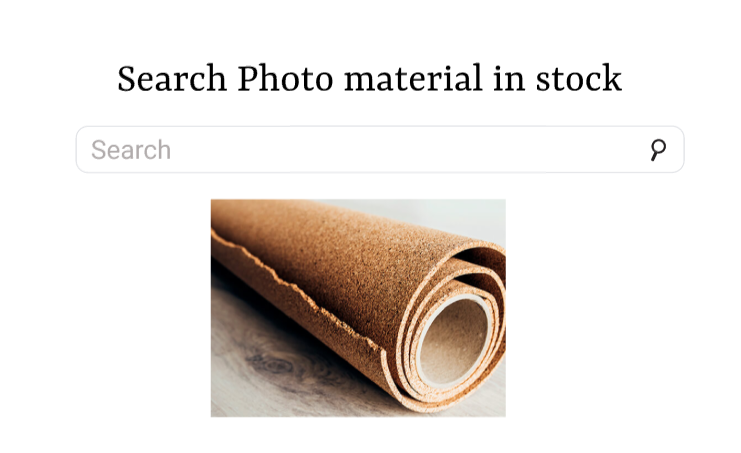

# Search Photo workshop

## Requirement

* ต้องการให้โปรแกรมสามารถค้นหารูปภาพใน Stock สินค้าได้
* ถ้าหากไม่พบสินค้าภายใน Stock หรือว่า ไม่มีภาพสินค้านั้น ให้แสดง Error 404 ทันที

> สำหรับ Workshop นี้ทำให้ได้เรียนรู้เกี่ยวกับเรื่อง DOM manipulation ซึ่งการจัดการ DOM เป็นส่วนทีสำคัญเป็นอย่างยิ่งในการเปลี่ยนแปลงส่วนต่างๆ ของ HTML



## Table of content

* [HMTL](#html)
* [CSS](#css)
* [javaScript](#javaScript)

### html

``` html
<!-- Headder -->
<h1>Search Photo material in stock</h1>

<!-- search box -->
<input type="text" placeholder="search photos in stock">

<!-- For result photos -->
<div class="photos"></div>

<script src="searchPhotos.js"></script>
```

***อธิบาย Code***

* สร้าง Element H1 เพื่อสร้าง Header
* สร้าง Element Input เพื่อสร้าง Search box
* สร้าง Class="photos" เพื่อให้รองรับการแสดงรูปภาพจาก javaScript

### CSS

``` css

* {

    box-sizing: border-box;
}

body {
    padding: 0;
    margin: 0;
    text-align: center;
}

h1 {
    font-family: roboto;
    font-size: 4rem;
}

input {
    border: 1px solid #dfe1e5;
    border-radius: 24px;
    padding: 20px;
    width: 50%;
    height: 50px;
    margin-bottom: 45px;
    font-size: 20px;
}

input:focus {
    outline: none;
}
```

### JavaScript

``` js
// key search
function keywordSearch(keyword) {

    if (checkFileExist(keyword)) {
        // if keyword matching show this result
        const stockPhoto = document.createElement('img')
        stockPhoto.src = `asset/photo-${keyword}.jpg` ;

        const displayPhoto = document.querySelector('.photos')
        displayPhoto.appendChild(stockPhoto);
    } else {
        // if keywrod is not matching show this result
        const noPhotos = document.createElement('img');
        noPhotos.src = "asset/error404.png";
        const displayPhoto = document.querySelector('.photos')
        displayPhoto.appendChild(noPhotos);
    }
}

// function remove photo
function removePhotos() {
    const photosElment = document.querySelector('.photos');
    photosElment.innerHTML = '';
}

// function file before send result
function checkFileExist(keyword) {
    var http = new XMLHttpRequest();

    http.open('HEAD', `asset/photo-${keyword}.jpg` , false);
    http.send();
    if (http.status === 200) {
        return true;
    }
    return false;
}

// function search
function searchPhotos(event) {
    const keyword = event.target.value;
    console.log(keyword, event.key)

    if (event.key === 'Enter' && keyword) {
        console.log('match')
        removePhotos();
        keywordSearch(keyword);
    }

}
```

***อธิบาย Code function run***

* const inputEle = document.querySelector('input'); คือการเรียกใช้ Element input โดยการสร้างตัวแปรเพื่อมารับค่าที่อยู่หน้า HTML

* inputEle.addEventListener('keydown', searchPhotos) คือเราต้องให้ Element นี้ทำงานอย่างไร โดยในที่นี่คือ keydown, และเรียกใช้งาน Function searchPhotos

```js
// function run
function run() {
    const inputEle = document.querySelector('input');
    inputEle.addEventListener('keydown', searchPhotos)
}

run();
```
