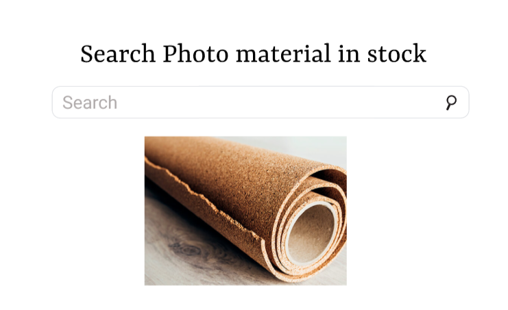

# Search Photo workshop

## Requirement

* ต้องการให้โปรแกรมสามารถค้นหารูปภาพใน Stock สินค้าได้
* ถ้าหากไม่พบสินค้าภายใน Stock หรือว่า ไม่มีภาพสินค้านั้น ให้แสดง Error 404 ทันที

> สำหรับ Workshop นี้ทำให้ได้เรียนรู้เกี่ยวกับเรื่อง DOM manipulation ซึ่งการจัดการ DOM เป็นส่วนทีสำคัญเป็นอย่างยิ่งในการเปลี่ยนแปลงส่วนต่างๆ ของ HTML



## Table of content

* [HMTL](html)
* [CSS](css)
* [javaScript](JavaScript)

### html

``` html
<!-- Headder -->
<h1>Search Photo material in stock</h1>

<!-- search box -->
<input type="text" placeholder="search photos in stock">

<!-- For result photos -->
<div class="photos"></div>

<script src="searchPhotos.js"></script>
```

### CSS

### JavaScript
